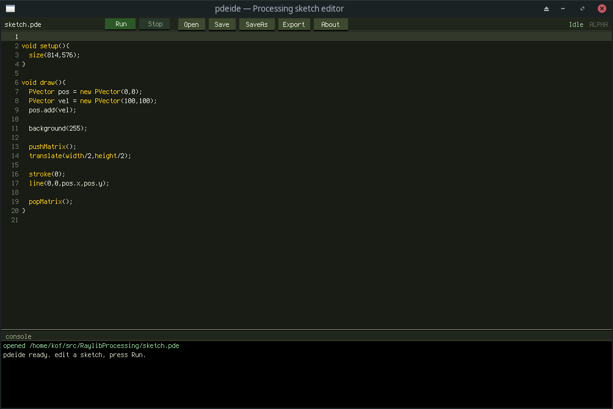

# Processing in Raylib

Transpile `.pde` Processing sketches to plain C and run them on raylib,
without Java. `pde2c` does the transpiling, `processing.h` is the
single-header runtime API, and `pdeide` is a small editor wrapping the chain.



> ALPHA quality: useful, honest, incomplete. Not supported yet: inheritance,
> generics, external Java libraries, `try/catch`, most `String` methods.

## Quick start

```sh
./run                    # run the sketch in the current directory
./pdecc ~/my/sketch.pde  # build an optimized binary next to the source
./build/pdeide           # launch the editor
```

## Build

```sh
cmake -S . -B build            # submodules (raylib, freetype) bootstrapped automatically
cmake --build build -j
ctest --test-dir build         # editor unit tests
cmake --build build --target release   # -> build/pdeide-linux.tar.gz
```

Health checks against real-world sketches: `./wildtest ~/src/2021`,
`./corpus.sh ../2010`. See [TODO.md](TODO.md) for the roadmap.

Author: Kof, 2026 — community software, provided as-is.